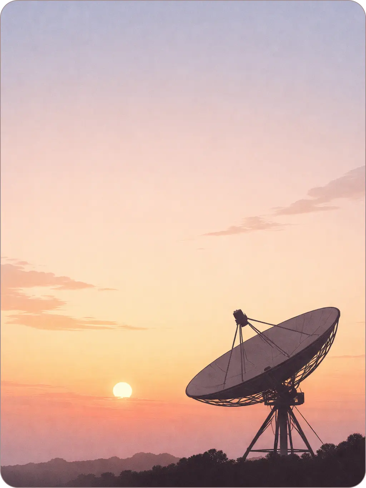

<!-- 

	 

 -->

 

**> 16 · Developer · Radio Enthusiast <**

Building open-source tools and hardware experiments.  

<a href="https://douxx.tech">Website</a> • 
<a href="https://douxx.tech/donate">Donate</a> • 
<a href="https://douxx.blog/?p=8-how-i-built-a-random-number-generator-sort-of">My Latest Article</a>

  

---

	

		
<b>Main Projects</b>

		 
		
		
	

---