	 

<!---->

 

	 

	
<b>We received a proper request from your browser.</b>

	
Not sorry about that. Do not try refreshing and don't contact us if the problem persists.

	

		<a href="https://douxx.tech">Contact Me</a> —
		<a href="https://douxx.tech/donate">Support Me</a> —
		<a href="https://douxx.blog/">My Latest Article</a>
	

	 

	 
Main Projects

	 
	 
	 

<!--taken from https://github.com/theMackabu/theMackabu/-->
